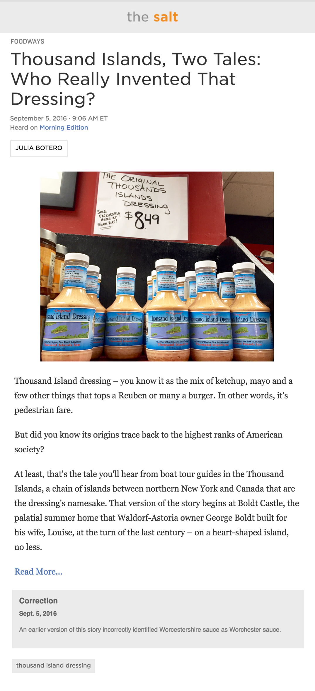

#Warmup - Basic CSS - Mockup for NPR The Salt

###The Mockup


###Setup Instructions
```
cd ~/TIY/warmups
mkdir basic-css-npr-salt
cd basic-css-npr-salt
curl https://raw.githubusercontent.com/t3warmups/warmup-basic-css-npr-the-salt/master/images/warmup-files.zip > warmup-files.zip
unzip warmup-files.zip
```

###Designer Specs
```
font + color for 'the salt' nav-bar font:
'GillSans', #8a8a8a , #ef8e33 
(note: font-weight for 'salt' is 600)

font for the header content:
'GillSans'

font for the article-content
'Palatino'

background color for the 'the salt' navbar, the 'Correction' area, and button at bottom:
#dddddd;

Contributor 'Julia Botero' border color:
#dddddd

'Morning edition' & 'Read more...' link color:
#5076b8

dark gray font color (in 'Correction' and button at bottom):
#636363
```
